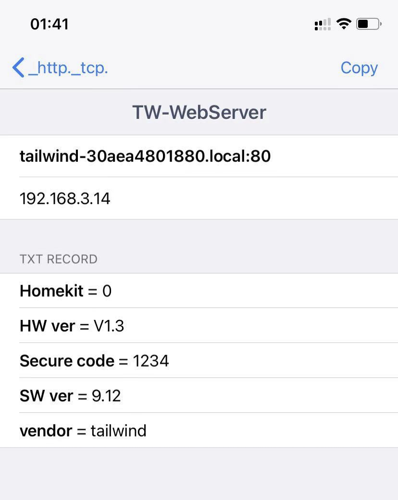
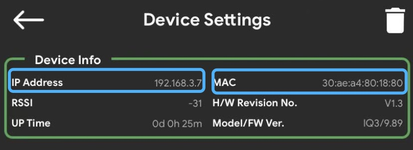
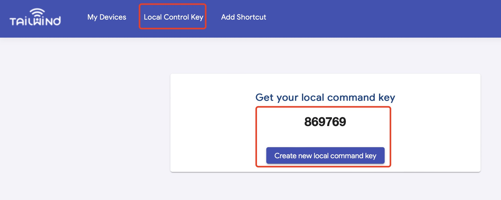
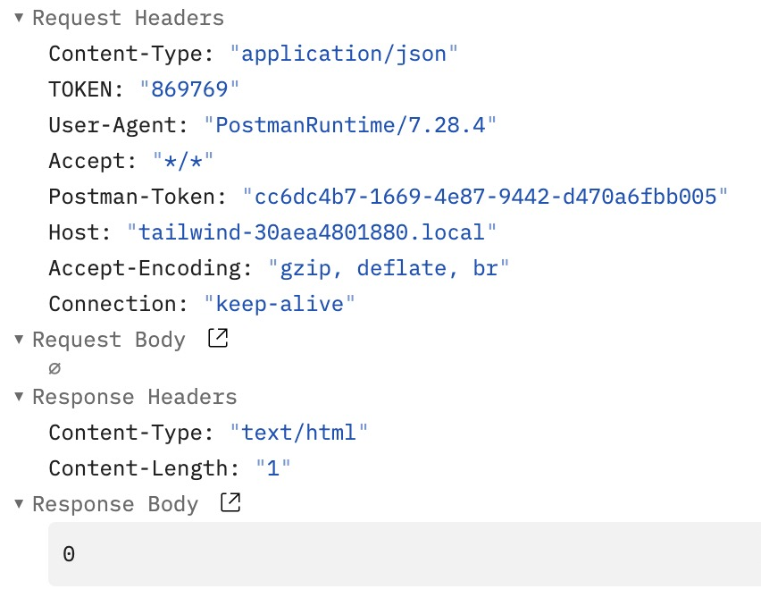

# Local Network Control

> Latest implementation in v9.97 firmware

There is a HTTP server running on the Tailwind iQ3 Garage Door Opener so we can send HTTP requests to the specific URLs to write or send commands or read the status from the HTTP server.(Currently, local network control is under beta test stage. More security features would be involved in later versions.)


In order to get it work, we need the following steps: <br>
1.Find devices in the local network <br>
2.Read device basic information.(Model ID, FW version )
3. Read device status or send control commands to the device.


## 1. Find devices in local network

In the current solution, we can use mDNS to search for local devices.<br>


#### a. We will find TW-WebServer service under _http._tcp services.
We can also find the information about the device.

mDNS TXT Record:
| Vendor | tailwind | company name | 
|-------|:---:|-----------|
| HW ver | V1.3 | Hardware version
| SW ver | 9.97 | Firmware version |
| device_id | _30_ae_a4_80_18_80_ | Device ID |
| HomeKit | 1 | 1: support HomeKit 0: no HomeKit |
| Product | iQ3 | Product model type |


#### b. we can also use this command in terminal

```
dns-sd -Z
_http._tcp                                      PTR     TW-WebServer._http._tcp
TW-WebServer._http._tcp                         SRV     0 0 80 tailwind-30aea4801880.local. ; Replace with unicast FQDN of target host
TW-WebServer._http._tcp                         TXT     "device_id=_30_ae_a4_80_18_80_" "Secure code=1234" "Homekit=0" "SW ver=9.95" "HW ver=V1.0" "vendor=tailwind"
dns-sd -G v4 tailwind-30aea4801880.local
DATE: ---Sat 15 May 2021---
11:35:27.080  ...STARTING...
Timestamp     A/R    Flags if Hostname                               Address                                   TTL
11:35:27.294  Add        2  4 tailwind-30aea4801880.local.           192.168.3.7                               120
```

#### c. The device URL is pre-defined with device ID.




We can find the device IP address and MAC in the Tailwind App, then build the device address like this:<br>
MAC: 30:ae:a4:80:18:80 <br>
Device Address in local network: tailwind-30aea4801880.local <br>
IP Address: 192.168.3.7

Examples:
| MAC | dev_id | mDNS address | 
|-------|:---:|-----------|
| AA:BB:CC:DD:EE:FF | \_aa_bb_cc_dd_ee_ff_ | tailwind-aabbccddeeff.local
| AA:0B:0C:D0:E0:F0 | \_aa_b_c_d0_e0_f0_ | tailwind-aa0b0cd0e0f0.local |
| 0A:BB:CC:0D:EE:DD | \_a_bb_cc_d_ee_dd_ | tailwind-0abbcc0deedd.local |

After this step, we will get the device address in 2 style:<br>
IP Address, e.g. 192.168.3.7 (this might be faster, but the IP address could also change) <br>
Local link domain, e.g. tailwind-xxxxxxxxxxxx.local

## 2. TOKEN

> In the latest version of device firmware(v9.96 and above), we've added a Token in the local control interface for security reasons. 

The TOKEN is a 6-digit string(local control key) generated via the Tailwind server


Steps to find and update Local Control Key:     
a.Login on Tailwind Web dashboard (web.gotailwind.com) <br>
b.Find the Local Control Key page and get the code. <br>
c. If the key is leaked, you may create a new one.(make sure device is online when generating a new password) <br>



<br>
After getting the KEY, we need to put the key into the HTTP request Header.

Take curl as example, <br>
curl http://tailwind-30aea4801880.local/status -H "TOKEN:869769"

The raw content of the request would be like this, a TOKEN filed will be added into   Request Headers. <br>




## 3.JSON Command Format(supported since v9.96 firmware)

### 3.1 Read Device Status (For all kinds of devices)

| Brief | Get device status, this is a general command for different types of devices. | 
|-------|:---|
| HTTP URL | http://tailwind-30aea4801880.local/json |
| HTTP Method | POST | 
| JSON Data |     {<br>  "version": "0.1",<br>"data": {<br>"type": "get",<br>"name": "dev_st"<br>}<br>} |
| Response | iQ3 device response: <br> {"result": "OK","product": "iQ3","dev_id": "_30_ae_a4_80_18_80_","proto_ver": "0.2","door_num": 3,"night_mode_en": 0,"fw_ver": “10.10","led_brightness": 10, "router_rssi": -31, "data": {"door1": {"index": 0,"status": "open","lockup": 0,"disabled": 0},"door2": {"index": 1,"status": "close","lockup": 0,"disabled": 0},"door3": {"index": 2,"status": "close","lockup": 0,"disabled": 0}}} <br><br>Light device response:<br>{"result": "OK","product": "light","dev_id": "_30_ae_a4_80_18_80_","proto_ver": "0.1","pwm_channel": 1,"fw_ver": "9.03","data": {"mode":"auto","light": {"power": 29,"frequency": 5000 },"radar": {"distance": 15,"lux": 1000,"delay": 300}}}<br><br>Fail: <br>{"result": "Fail","message":"xxxxxx"} <br>|
| Device Action | Return current device status in JSON format.|
|CURL example | curl http://tailwind-30aea4801880.local/json -d '{"version": "0.1", "data": {"type": "get", "name": "dev_st"}}' -H "TOKEN:869769" |

| Key | Value | Example | Brief |
| --  | ---   | ---     | ---   |
| version | string | "0.1" | JSON protocol version number, 0.1 for current version, reserved for future useage |
| data | JSON object | | |
| type | string | "get" | get: read <br> set: write <br> |
| name | string | "dev_set" | Read device status |


### 3.2 Set Status Report URL (For all kinds of devices)

When device status changes, it can send a report or notification to an HTTP or UDP server in the local network.(Check 3.1 for the status report data format)<br>
Use this API to set the notification URL.(HTTPS not supported yet.)

| Brief | Set Door Status Report Address|
| -- | :-- |
| HTTP URL | http://tailwind-30aea4801880.local/json |  
| HTTP Method | POST |
| JSON Data | {<br>"product": "iQ3",<br>"version": "0.1"<br>"data": {<br>"type": "set",<br>"name": "notify_url",<br>"value": {<br>"url": "http://192.168.1.1:8888/report”,<br>"proto": "http",<br>"enable": 1,<br>}<br>}<br>}<br>|
| Response | {"result": "OK"}<br><br>{"result": "Fail", "Info": "xxxxxx"}<br> |
| Device Action | Set how the device should report door status when door status changed.
HTTP server and UDP server can either be supported now.|
| CURL example |HTTP:<br>curl http://tailwind-30aea4801880.local/json -d '{"product": "iQ3", "version": "0.1", "data": {"type": "set", "name": "notify_url", "value": {"enable": 1,"proto":"http", "url":"http://192.168.3.61:8888/test"}}}' -H "TOKEN:869769"<br><br>UDP:<br>curl http://tailwind-30aea4801880.local/json -d '{"product": "iQ3", "version": "0.1", "data": {"type": "set", "name": "notify_url", "value": {"enable": 1,"proto":"udp", "url":"192.168.3.61:8888"}}}' -H "TOKEN:869769"<br>|

| Key | Value | Example | Brief |
| --  | ---   | ---     | ---   |
| product | string | "iQ3" | iQ3:Garage door opener device <br>Light: Light Controller device <br>|
| version | string | "0.1" | JSON protocol version number, 0.1 for current version, reserved for future useage |
| data | JSON object | | |
| type | string | "set" | get: read <br> set: write <br> |
| name | string | "notify_url" | Set device notification method |
| value | JSON object | | |
| url | string | HTTP:<br>"http://192.168.1.1:8888/report" <br>or<br>UDP:<br>"192.168.1.1:6888"| UDP or HTTP URL for device to report its status. The length should be less than 200 bytes.|
| proto | string | "http" or "udp" | http: send status report in HTTP<br>udp: send status report in UDP<br>|
|enable | integer | 1 | 1: enable status report<br>0: disable status report<br>|

The payload of a device notification message would like this:<br>
The JSON object with key named 'notify' is the notification event, it indicates with door's status has changed.<br>
Others are the current status of the device<br><br>

{"result": "OK","product": "iQ3","dev_id": "_30_ae_a4_80_18_80_","proto_ver": "0.1","door_num": 3,"night_mode_en": 1,"fw_ver": "10.10","led_brightness": 10,"data": {"door1": {"index": 0,"status": "close","lockup": 0,"disabled": 0}
,"door2": {"index": 1,"status": "open","lockup": 0,"disabled": 0}
,"door3": {"index": 2,"status": "close","lockup": 0,"disabled": 0}
},<br><font size="4" color="red">"notify": {"door_idx": 2,"event": "open"}</font>
}

Currently supported events are: 
| Event | Description |
|-------|:---|
| open | Door opened |
| close | Door closed |
| lock | Door lockup |
| enable | Door enabled |
| disable | Door disabled |
| reboot | Device rebooted after receiving a reboot command|


### 3.3 Open or Close Door Command (For iQ3 devices, supported since v9.96)

| Brief | Open / Close Door Command | 
|-------|:---|
| HTTP URL | http://tailwind-30aea4801880.local/json |
| HTTP Method | POST | 
| JSON Data| {<br>"product": "iQ3",<br>"version": "0.1",<br>"data": {<br>"type": "set",<br>"name": "door_op",<br>"value": {<br>"door_idx": 1,<br>"cmd": "open",<br>}<br>}<br>}<br> |
|Response| {"result": "OK"} <br>{"result": "Fail","message":"xxxxxx"}<br>|
| Device Action| For open/close door command, if door is currently closed/open, trigger IO pulse to open/close the door.|
| CURL example| open door: <br> curl http://tailwind-30aea4801880.local/json -d '{"product": "iQ3", "version": "0.1", "data": {"type": "set", "name": "door_op","value":{"door_idx":1, "cmd":"open"}}}' -H "TOKEN:869769"<br><br> close door: <br> curl http://tailwind-30aea4801880.local/json -d '{"product": "iQ3", "version": "0.1", "data": {"type": "set", "name": "door_op","value":{"door_idx":1, "cmd":"close"}}}' -H "TOKEN:869769"<br><br> partial open door: <br> curl http://tailwind-30aea4801880.local/json -d '{"product": "iQ3", "version": "0.1", "data": {"type": "set", "name": "door_op","value":{"door_idx":1, "cmd":"open", "partial_time": 15000}}}' -H "TOKEN:869769"<br>|

| Key | Value | Example | Brief |
| --  | ---   | ---     | ---   |
| product | string | "iQ3" | iQ3:Garage door opener device <br>Light: Light Controller device <br>|
| version | string | "0.1" | JSON protocol version number, 0.1 for current version, reserved for future useage |
| data | JSON object | | |
| type | string | "set" | get: read <br> set: write <br> |
| name | string | "door_op" | Door Open/Close Operation |
| value | JSON object | | |
| door_idx | integer | 1 |0: door 1<br>1: door 2<br>2: door 3<br>|
| cmd | string | "open" | "open”: open door<br>"close”: close door<br>|
|partial_time| integer|15000|optional. Door partial open time (ms). Only work with open door command.|

> Note: if door status changed due to the command, a FCM notification will be sent to the phone app with the following format: <br><br> Local Network Control opened/closed xxx(Devcie Name) yyy(Door Name) on ddd(Date) at ttt(Time)

### 3.4 Set Status LED Brightness(For iQ3 device, supported since 9.96)

> Now we can set the brightness of Green status LED that indicates the device is online.

| Brief | Set Door Status LED Brightness | 
|-------|:---|
| HTTP URL | http://tailwind-30aea4801880.local/json |
| HTTP Method | POST | 
| JSON Data|     {<br>"product": "iQ3",<br>"version": "0.1"<br>"data": {<br>"type": "set",<br>"name": "status_led",<br>"value": {<br>"brightness": 100<br>}<br>}<br>}<br>|
|Response|{"result": "OK"}<br>{"result": "Fail", "Info": "xxxxxx"}|
|Device Action|Device will set the Green LED brightness after it gets online successfully.|
|CURL example| curl http://tailwind-30aea4801880.local/json -d '{"product": "iQ3", "version": "0.1", "data": {"type": "set", "name": "status_led", "value": {"brightness": 100}}}' -H "TOKEN:869769"|


| Key | Value | Example | Brief |
| --  | ---   | ---     | ---   |
| product | string | "iQ3" | iQ3:Garage door opener device <br>Light: Light Controller device <br>|
| version | string | "0.1" | JSON protocol version number, 0.1 for current version, reserved for future useage |
| data | JSON object | | |
| type | string | "set" | get: read <br> set: write <br> |
| name | string | "status_led" | Set status LED brightness |
| value | JSON object | | |
| brightness | integer | 100 | Brightness of the Green LED.ranges from 0 to 100.|

### 3.5 Set Light Parameters (For Light device)

> Use this to set different parameters of a Light Controller device.


| Brief | Configure a Light Controller Device | 
|-------|:---|
| HTTP URL | http://tailwind-30aea4801880.local/json |
| HTTP Method | POST | 
| JSON Data|   {<br>"product":"light",<br>"version":"0.1",<br> "data":{<br>"type":"set",<br>"name":"dev_op",<br>"value":{<br>"power":50,<br>"delay":300,<br>"lux":1000,<br>"distance":15,<br>"mode":"auto"<br>}<br>}<br>}|
|Response|{"result": "OK"}<br>{"result": "Fail", "Info": "xxxxxx"}|
|Device Action|Device will parse each give parameters and apply those given parameters.|
|CURL example| curl http://tailwind-30aea4801880.local/json -d '{"product":"light","version":"0.1", "data":{"type":"set","name":"dev_op","value":{"power":50,"delay":300,"lux":1000,"distance":15,"mode":"auto"}}}' -H "TOKEN:869769"<br><br>curl http://tailwind-30aea4801880.local/json -d '{"product":"light","version":"0.1", "data":{"type":"set","name":"dev_op","value":{"power":50, "mode":"manual"}}}' -H "TOKEN:869769"|


| Key | Value | Example | Brief |
| --  | ---   | ---     | ---   |
| product | string | "light" | light: Light Controller device <br>|
| version | string | "0.1" | JSON protocol version number, 0.1 for current version, reserved for future useage |
| data | JSON object | | |
| type | string | "set" | get: read <br> set: write <br> |
| name | string | "dev_op" | Set Light Controller Parameters |
| value | JSON object | | |
| power | integer | 50 | Set brightness of the Lightranges from 0 to 100.(optional).|
| delay | integer | 300 | when motion detected, how long the light would be kept on, count in seconds.(0-65535)(optional)|
| lux | integer | 1000 | when the ambient light is weaker than this level, radar sensor starts to work. ( 0 ~ 65535 Lux)(optional)|
|distance | integer | 15 | sensitivity level of the radar sensor, ranges from 0 to 15)(optional)|
|mode|string|"auto"|"manual": user sets light brightness, the light stays with the brightness no matter how the radar sensor reads.<br><br>"auto": user sets radar sensor parameters, the light will be controlled by the radar sensor signal(optional)|


### 3.6 Identify device (supported since v10.10 firmware)

> Use this to identify an iQ3 device. The selected device would blink the white light three times.


| Brief | To identify a Device | 
|-------|:---|
| HTTP URL | http://tailwind-30aea4801880.local/json |
| HTTP Method | POST | 
| JSON Data|       {<br>"product": "iQ3",<br>"version": "0.2"<br>"data": {<br>"type": "set",<br>"name": “identify"<br>}<br>}|
|Response|{"result": "OK"}<br>{"result": "Fail", "Info": "xxxxxx"}|
|Device Action|Device will blink the white led thress times.|
|CURL example| curl http://tailwind-30aea4801880.local/json -d '{"product": "iQ3", "version": “0.2", "data": {"type": "set", "name": "identify"}}' -H "TOKEN:869769"|


| Key | Value | Example | Brief |
| --  | ---   | ---     | ---   |
| product | string | "iQ3" | iQ3:Garage door opener device <br>Light: Light Controller device <br>|
| version | string | "0.2" | JSON protocol version number, 0.2 for current version, reserved for future useage |
| data | JSON object | | |
| type | string | "set" | get: read <br> set: write <br> |
| name | string | "identify" | To identify the device |

### 3.7 Reboot device (supported since v10.10 firmware)

> Use this to reboot an iQ3 device. 


| Brief | To identify a Device | 
|-------|:---|
| HTTP URL | http://tailwind-30aea4801880.local/json |
| HTTP Method | POST | 
| JSON Data|       {<br>"product": "iQ3",<br>"version": "0.2"<br>"data": {<br>"type": "set",<br>"name": reboot"<br>}<br>}|
|Response|{"result": "OK"}<br>{"result": "Fail", "Info": "xxxxxx"}|
|Device Action|Device will reboot in about 2 seconds.|
|CURL example| curl http://tailwind-30aea4801880.local/json -d '{"product": "iQ3", "version": “0.2", "data": {"type": "set", "name": "reboot"}}' -H "TOKEN:869769"|


| Key | Value | Example | Brief |
| --  | ---   | ---     | ---   |
| product | string | "iQ3" | iQ3:Garage door opener device <br>Light: Light Controller device <br>|
| version | string | "0.2" | JSON protocol version number, 0.2 for current version, reserved for future useage |
| data | JSON object | | |
| type | string | "set" | get: read <br> set: write <br> |
| name | string | "reboot" | To reboot the device |

