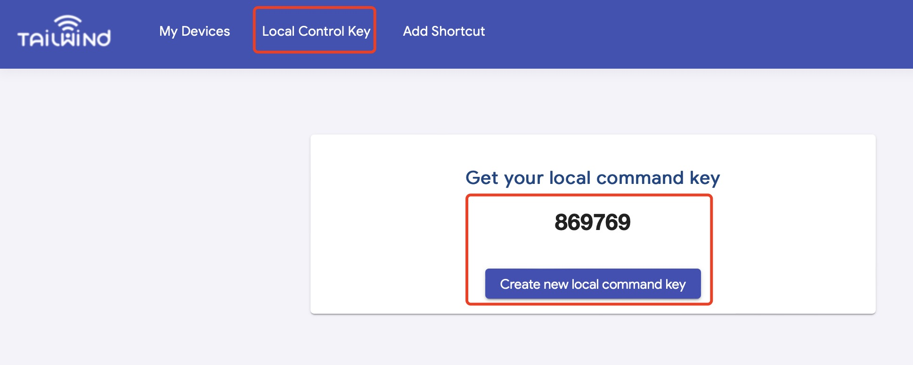
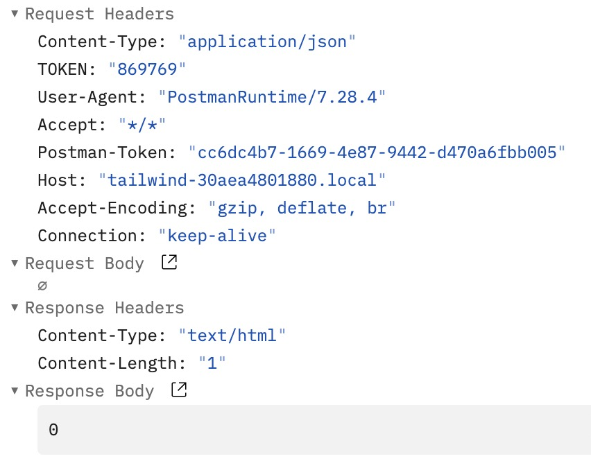

# Local Network Control

> Latest implementation in v9.97 firmware

There is a HTTP server running on the Tailwind Garage Door Opener iQ3, so that we can send HTTP request to the specific URLs to write command to or read status from the HTTP server.(Currently, local network control is under beta test stage. More security feature would be involved in later versions.)


In order to get it work, we need the following several steps: <br>
1.Find devices in local network <br>
2.Read device basic information.(Model ID, FW version )
3. Then read device status or send control commands to device.


## 1. Find devices in local network

In current solution, we can use mDNS to search local devices.<br>


#### a. We will find TW-WebServer service under _http._tcp services.
We can also find the information about the device.

mDNS TXT Record:
| Vendor | tailwind | company name | 
|-------|:---:|-----------|
| HW ver | V1.3 | Hardware version
| SW ver | 9.97 | Firmware version |
| device_id | _30_ae_a4_80_18_80_ | Device ID |
| HomeKit | 1 | 1: support HomeKit 0: no HomeKit |
| Product | iQ3 | Product model type |


#### b. we can also use this command in terminal

```
dns-sd -Z
_http._tcp                                      PTR     TW-WebServer._http._tcp
TW-WebServer._http._tcp                         SRV     0 0 80 tailwind-30aea4801880.local. ; Replace with unicast FQDN of target host
TW-WebServer._http._tcp                         TXT     "device_id=_30_ae_a4_80_18_80_" "Secure code=1234" "Homekit=0" "SW ver=9.95" "HW ver=V1.0" “vendor=tailwind"
dns-sd -G v4 tailwind-30aea4801880.local
DATE: ---Sat 15 May 2021---
11:35:27.080  ...STARTING...
Timestamp     A/R    Flags if Hostname                               Address                                   TTL
11:35:27.294  Add        2  4 tailwind-30aea4801880.local.           192.168.3.7                               120
```

#### c. The device URL is pre-defined with device ID.


We can find device IP address and MAC in tailwind App, then build the device address like this:<br>
MAC: 30:ae:a4:80:18:80 <br>
Device Address in local network: tailwind-30aea4801880.local <br>
IP Address: 192.168.3.7

Examples:
| MAC | dev_id | mDNS address | 
|-------|:---:|-----------|
| AA:BB:CC:DD:EE:FF | \_aa_bb_cc_dd_ee_ff_ | tailwind-aabbccddeeff.local
| AA:0B:0C:D0:E0:F0 | \_aa_b_c_d0_e0_f0_ | tailwind-aa0b0cd0e0f0.local |
| 0A:BB:CC:0D:EE:DD | \_a_bb_cc_d_ee_dd_ | tailwind-0abbcc0deedd.local |

After this step, we will get the device address in 2 style:<br>
IP Address, e.g. 192.168.3.7 (this might be faster, but IP address could also change) <br>
Local link domain, e.g. tailwind-xxxxxxxxxxxx.local

## 2. TOKEN

> In latest version of device firmware(v9.96 and above), we've added a Token in local control interface for security concern. 

The TOKEN is a 6-digit string(local control key) generated via Tailwind server


Steps to find and update Local Control Key:     
a.Login on Tailwind Web dashboard (web.gotailwind.com) <br>
b.Find the Local Control Key page and get the code. <br>
c. If the key is leaked, you may create a new one.(make sure device is online when generating a new password) <br>



<br>
After getting the KEY, we need to put the key into the HTTP request Header.

Take curl as example, <br>
curl http://tailwind-30aea4801880.local/status -H "TOKEN:869769"

The raw content of the request would be like this, a TOKEN filed will be added into   Request Headers. <br>




## 3.Command Format(deprecated, but still supported)

### 3.1 Read Door Status(deprecated)


> When sending commands to local control HTTP server, a field of TOKEN should be added in the HTTP request HEADER. 

> Local control key can be updated on website(web.tailwind.com), after refreshing the key, a command will be sent to device to update the TOKEN accordingly.


Example:<br>
request: <br>
curl http://192.168.3.7/status -H "TOKEN:123456"<br>
response: <br>
0


### 3.1 Send Door Command(deprecated)


Example:
request:<br>
curl http://192.168.3.7/cmd -d 2 -H "TOKEN:1234567890"<br><br>
response:<br>
0

curl http://tailwind-30aea4801880.local/cmd -d -4 -H "TOKEN:1234567890"
OK